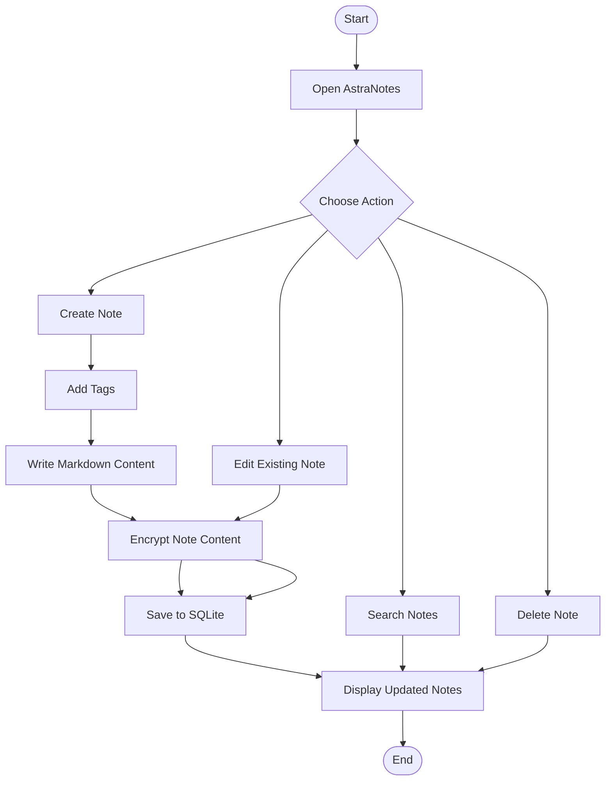

# AstraNotes Activity Diagram

```mermaid
flowchart TD
    Start([Start])
    Open[Open AstraNotes]
    Choose{Choose Action}

    Create[Create Note]
    AddTags[Add Tags]
    Markdown[Write Markdown Content]
    Encrypt[Encrypt Note Content]
    Save[Save to SQLite]

    Search[Search Notes]
    Edit[Edit Existing Note]
    Delete[Delete Note]

    Display[Display Updated Notes]
    End([End])

    Start --> Open
    Open --> Choose

    Choose --> Create
    Create --> AddTags
    AddTags --> Markdown
    Markdown --> Encrypt
    Encrypt --> Save
    Save --> Display

    Choose --> Search
    Search --> Display

    Choose --> Edit
    Edit --> Encrypt
    Encrypt --> Save

    Choose --> Delete
    Delete --> Display

    Display --> End
```