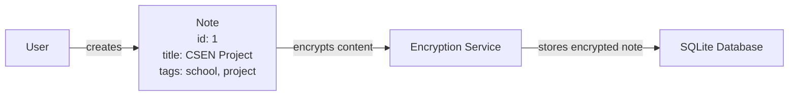

# AstraNotes Object Diagram

```mermaid
flowchart LR

User["User"]

Note["Note
id: 1
title: CSEN Project
tags: school, project"]

Encryption["Encryption Service"]

Database["SQLite Database"]

User -->|creates| Note
Note -->|encrypts content| Encryption
Encryption -->|stores encrypted note| Database
```